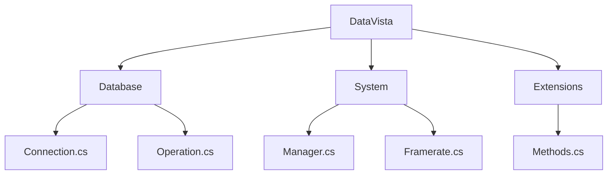

# DataVista
DataVista is a .NET library for:

    - Database interactions - System.Data.SqlClient (ADO.NET)
    - System management utilities - System.Management (WMI)
    - WPF

## NuGet package
- [nuget.org/packages/DataVista](https://www.nuget.org/packages/DataVista/)

## Prerequisites
- .NET 8.0
- [System.Data.SqlClient](https://www.nuget.org/packages/System.Data.SqlClient/)
- [System.Management](https://www.nuget.org/packages/System.Management/)

### Namespace

### Docs
  - [Example application](https://github.com/ag-86/DataVista/tree/master/Resources/ApplicationExample)
  - [Code snippets](https://github.com/ag-86/DataVista/tree/master/Resources/CodeSnippets)
  - [Class diagrams](https://github.com/ag-86/DataVista/tree/master/Resources/Documents/Class%20Diagrams)

