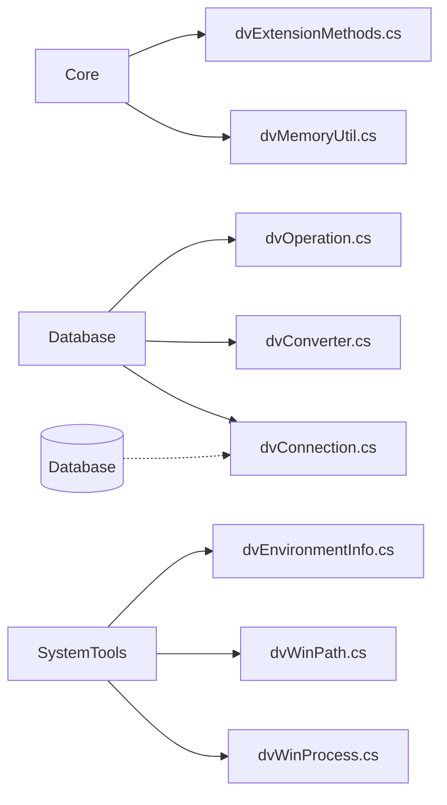

# DataVista
DataVista is a .NET library for:
- Database interactions - System.Data.SqlClient (ADO.NET)
- System management utilities - System.Management (WMI)
- WPF

## NuGet package
- [nuget.org/packages/DataVista](https://www.nuget.org/packages/DataVista/)

## Prerequisites
- .NET 8.0
- [System.Data.SqlClient](https://www.nuget.org/packages/System.Data.SqlClient/)
- [System.Management](https://www.nuget.org/packages/System.Management/)

## Quick Start
### 1. Add the NuGet package to your project
[Install NuGet client tools](https://learn.microsoft.com/en-us/nuget/install-nuget-client-tools?tabs=windows)

### 2. Setting up the App.config file (for database interactions)
[Add an application configuration file to a C# project](https://learn.microsoft.com/en-us/visualstudio/ide/how-to-add-app-config-file?view=vs-2022)

Configure this string for what suits your needs.

```xml
<?xml  version="1.0"  encoding="utf-8" ?>
<configuration>
 <configSections>
 </configSections>
 <connectionStrings>
 <add  name="MyConnectionString"
  connectionString="Data Source=MyServerName;
 Initial Catalog=MyDataBaseName;
 Integrated Security=True;
 Persist Security Info=False;
 Pooling=True;
 MultipleActiveResultSets=True;
 TrustServerCertificate=True"/>
 </connectionStrings>
</configuration>
```

This step is optional because you could always use **DataVista.Connection.CreateConnectionString()**.

Or you could use the [SqlConnectionStringBuilder Class](https://learn.microsoft.com/en-us/dotnet/api/system.data.sqlclient.sqlconnectionstringbuilder?view=dotnet-plat-ext-5.0).

### 3. Add the namespace using statement to your .cs file.
#### Namespace


## Docs
  - [Example application](https://github.com/ag-86/DataVista/tree/master/Resources/ApplicationExample)
  - [Code example](https://github.com/ag-86/DataVista/blob/master/Resources/CodeSnippets/CodeSnippets.md)
  - [Class diagrams](https://github.com/ag-86/DataVista/tree/master/Resources/Documents/Class%20Diagrams)


> [!IMPORTANT]
> **Connection(SqlConnection sqlConnection) constructor will read the connectionString from your App.config file**.
